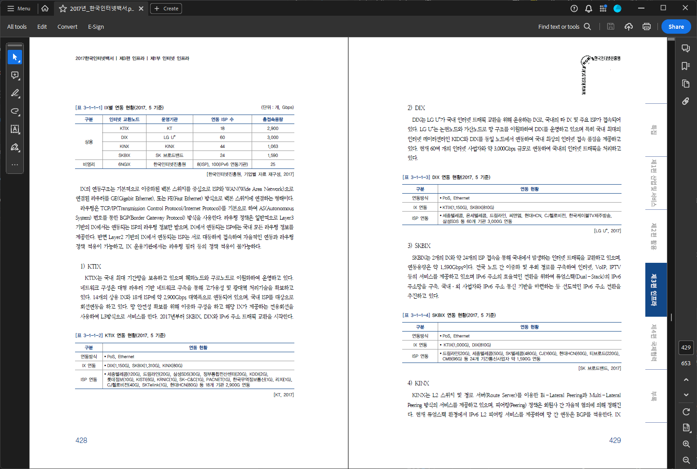
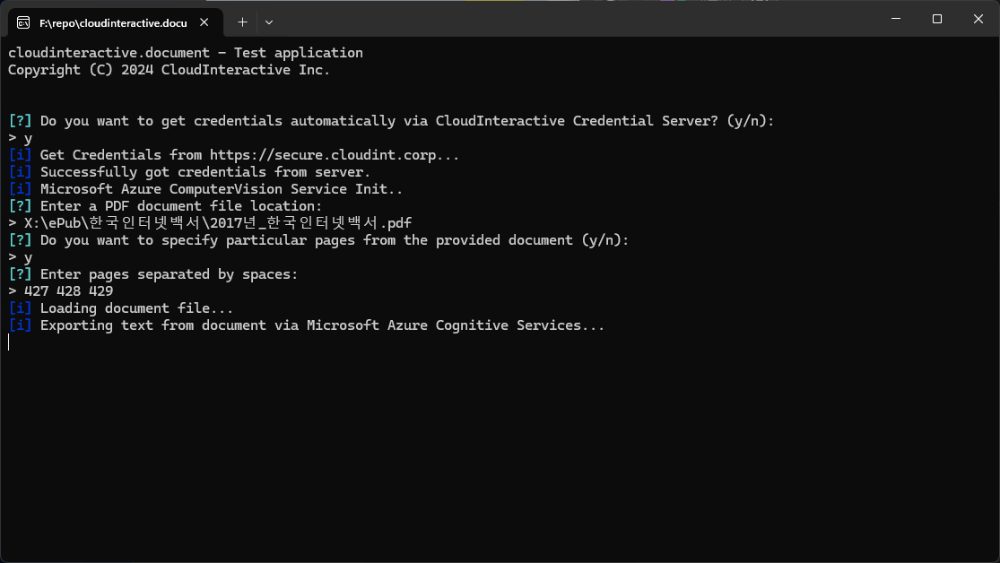
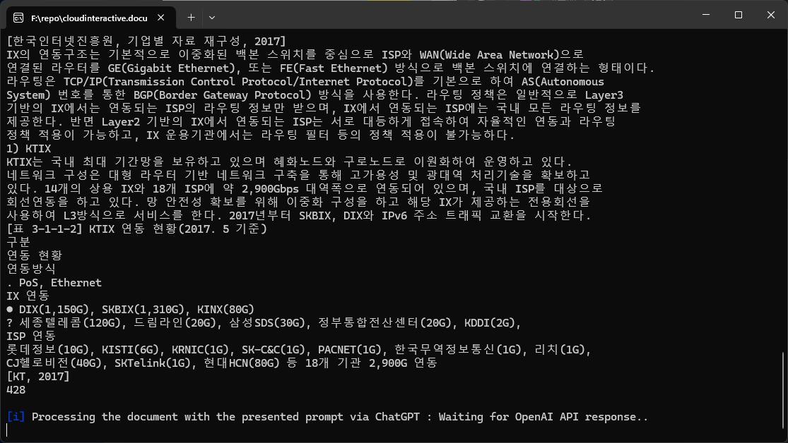
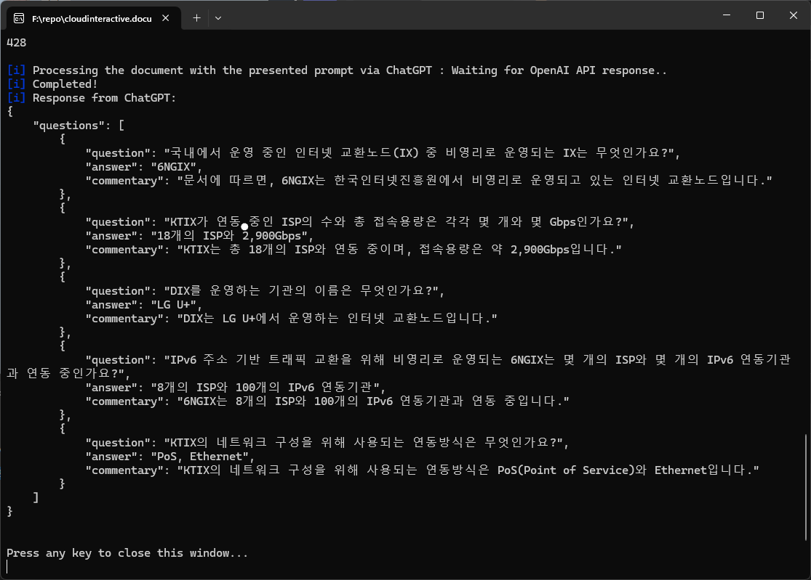

# cloudinteractive.document
**cloudinteractive.document is a simple C# document (Image, PDF) OCR and ChatGPT integration library project.**

Export text from PDF documents via Microsoft Azure Cognitive Service and process text via OpenAI ChatGPT. 

(A C# fork of [cloudinteractive-ai-insights](https://github.com/Coppermine-SP/cloudinteractive-ai-insights))

### Table of Contents
- [Responsible use of Generative AI](#responsible-use-of-generative-ai)
- [How to Use](#how-to-use)
- [Demo Application](#demo-app)
- [Dependencies](#dependencies)

## Responsible use of Generative AI

[책임감 있는 AI 사용이란 무엇입니까? (국문)](https://github.com/Coppermine-SP/Coppermine-SP/blob/main/ResponsibleUseOfAI_KR.md)

**WARNING:**
This project should only be used as an auxiliary tool. Generative AI is not a solution provider for your assignment. Relying on this tool to fully complete your assignments is a clear act of cheating. 

**Please agree to the responsible use of Generative AI before utilizing this tool.**

## How to Use
**Currently, this library only works in Windows.** 
> [!WARNING]
> System.Drawing is not supported in non-Windows platforms.
> 
> Alternatively, you can change project target framework to .NET 6 and enable System.Drawing support for non-Windows platforms by setting `System.Drawing.EnableUnixSupport` runtime configuration switch to `true` in the runtimeconfig.json file.
> 
> **It is untested and not recommended.**
>
> For more information, please check out this [Microsoft Documentation](https://aka.ms/systemdrawingnonwindows).

### Install from NuGet
Install cloudinteractive.document package from NuGet via CLI.
```powershell
Install-Package cloudinteractive.document
```

### Environment Setup
Define Third-party API credentials and endpoints.
```csharp
using cloudinteractive.document.Util

AzureComputerVision.Init(YOUR_AZURE_ENDPOINT, YOUR_AZURE_APIKEY);
OpenAI.Init(YOUR_OPENAI_APIKEY);
```

### Load documents
Load PDF or image document to IExportableDocument.
```csharp
using cloudinteractive.document

//load all pages on the local pdf, image file
var document_pdf1 = await PdfDocument.ImportFromFile(FILE_LOCATION);
var document_image1 = await ImageDocument.ImportFromFile(FILE_LOCATION);

//load specific pages on the local pdf file
var pages = new int[] {101, 102, 103, 104};
var document_pdf2 = await PdfDocument.ImportFromFile(FILE_LOCATION, pages);

//load all pages on the pdf, image stream
var document_pdf3 = await PdfDocuement.ImportFromStream(STREAM);
var document_image3 = await ImageDocument.ImportFromStream(STREAM);
```

### Export Text from the document
Export Text from document via Microsoft Azure Cognitive Service.
```csharp
var texts = await AzureComputerVision.ExportTextFromDocument(document);
```
`AzureComputerVision.ExportTextFromDocument()` method will return string[] and each element will contain texts from each page.

### Process Text via OpenAI ChatGPT
Process text from the document with a custom prompt via OpenAI ChatGPT API.
```csharp
var model = OpenAI_API.Models.Model.GPT4_Turbo;
string prompt = @"You are a test creator. Create 5 practice questions in Korean, with both questions and answers and an explanation of answer, based only on the content of this document. output should be in JSON format and follow this form: {
  ""questions"": [
    {
      ""question"": ""QUESTION"",
      ""answer"": ""ANSWER"",
      ""commentary"": ""Answer explanation""
    }
]"
string response = OpenAI.GetChatCompletion(prompt, texts, model);
```
`OpenAI.GetChatCompletion()` method concatenates all texts in pages and sends it to ChatGPT.

The default max length of each request is 2000 characters, it can be customized at ChatGPT module initialization.

> [!WARNING]
> `OpenAI.GetChatCompletion()` method will restrict ChatGPT to generate only valid JSON objects.
> 
> **If your prompt does not include explicit instructions to generate JSON, an exception will occur.**
>
> For more information, please check out this [OpenAI Documentation](https://platform.openai.com/docs/guides/text-generation/json-mode).

## Demo Application
A CLI demo application is included in this project.

You can evaluate this library and get sample code through this demo application.





## Dependencies
* [Ghostscript.NET](https://www.nuget.org/packages/Ghostscript.NET/1.2.3.1?_src=template) - AGPL 3.0 License
* [Microsoft.Azure.CongitiveServices.Vision.ComputerVision](https://www.nuget.org/packages/Microsoft.Azure.CognitiveServices.Vision.ComputerVision/7.0.1?_src=template) - MIT License
* [OpenAI](https://www.nuget.org/packages/OpenAI/1.10.0?_src=template) - CC0-1.0 License
* [System.Drawing.Common](https://www.nuget.org/packages/System.Drawing.Common/8.0.0?_src=template) - MIT License
